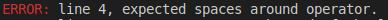

# Capstone Project: Build a beginners linter

> This is a simple linter for JavaScript files and informs about formatting errors.  


This takes a .js file and validates spacing, semicolons, opening and closing braces, spaces, correct names for indentifiers.

## Built With
- Ruby

## Getting Started

**To run this project yo have to have this repo on your computer**
To get a local copy up and running follow these simple steps.

### Prerequisites
- Rubocop
- Colorize

### Setup
Download or clone this repository to your machine.

* To clone, go to "Clone or Download" and click on Download ZIP and extract the files to a folder in your computer
* To Download go to "Clone or Download" and copy the link then go to your terminal and write ``` git clone [insert link here without brackets] ```.

### Usage
* Change the "test_read_file.js" to suit your needs
  Then run the executable file in your terminal : ``` ./bin/main.rb ```

### Run tests
* This is an example in the .js file
```
FirstName = 'John';
last_Name = 'Doe';

fullName = firstName+ lastName; 
```
This will display a warning and a error after you run the excecutable file



## Author

👤 **Luis Saavedra**

- Github: [@nriqu322](https://github.com/nriqu322)
- Twitter: [@nriqu322](https://twitter.com/nriqu322)
- Linkedin: [Luis Saavedra](https://linkedin.com/in/luis-saavedra-sanchez/)

## 🤝 Contributing

Contributions, issues and feature requests are welcome!

Feel free to check the [issues page](issues/).

## Show your support

Give a ⭐️ if you like this project!